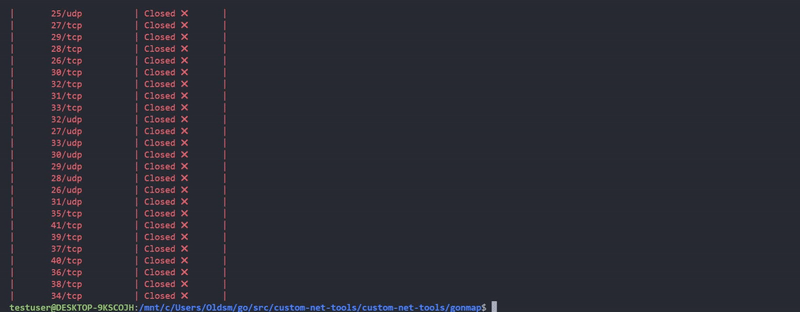

## Usage

To start using gonmap, clone this repo at first: 
```sh
$git clone https://github.com/tooBusyNow/custom-net-tools
``` 
then run:


```sh
$cd custom-net-tools/gonmap

$./gonmap.exe {target IPv4}
```
This will start gonmap in a single-threaded mode with top 20 most scanned ports <br>(according to the original Nmap database):

```sh
21: ftp
22: ssh
23: telnet
25: smtp
53: domain name system
80: http
110: pop3
111: rpcbind
135: msrpc
139: netbios-ssn
143: imap
443: https
445: microsoft-ds
993: imaps
995: pop3s
1723: pptp
3306: mysql
3389: ms-wbt-server
5900: vnc
8080: http-proxy
```

## Options

However, this is not the best way to use GOnmap. Because you don't run it in a multithreaded mode and don't specify ports to scan. So, you should better run it like that:

```sh
$./gomap.exe -p 20-50,15,5156-5170,22,8080 -mth 127.0.0.1
```

This will start gonmap in a multithreaded mode (`-mth` option) with ports (`-p` option): 20-50, 15, 5156-5170, 22, 8080.


-  `Do NOT use -p option in this way:` 


```sh
$./gomap.exe -p 20-50, 15, 5156-5170, 22, 8080 -mth 127.0.0.1
```
The current version of my program relies on `go flag package`, that can parse command line arguments as a sequense after option. So please, don't separate ports from each other. 


## Visualization

Might be helpful:


